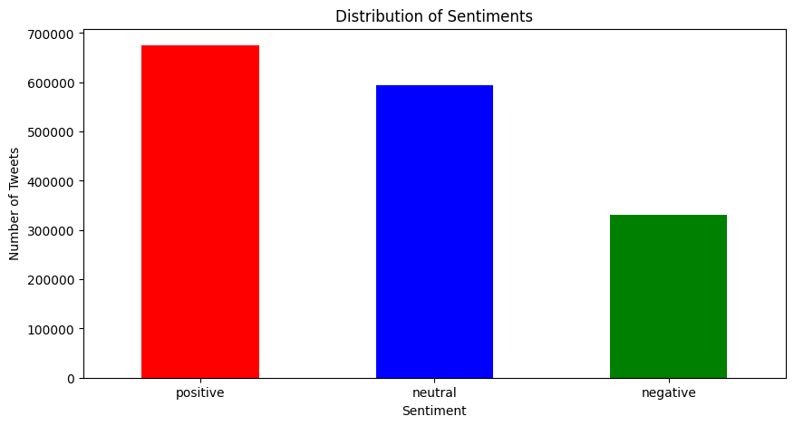
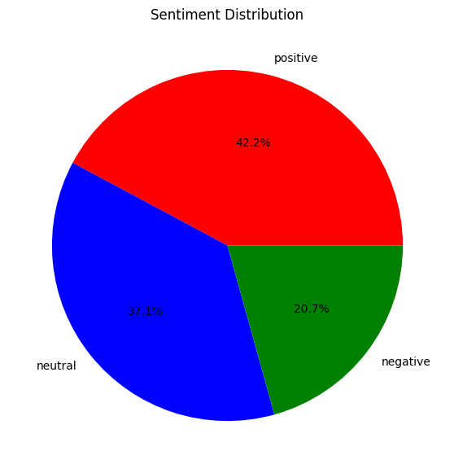

## Project Overview
This project focuses on performing **Sentiment Analysis** (Positive, Negative, Neutral) on text datasets using Natural Language Processing (NLP) techniques and Machine Learning algorithms. 

The goal is to extract meaningful insights from raw text data.

## Used Libraries
```python
import pandas as pd
import nltk
from nltk.corpus import stopwords
from nltk.tokenize import word_tokenize
import re
from textblob import TextBlob
import matplotlib.pyplot as plt
from wordcloud import WordCloud
nltk.download('punkt_tab')
```

## Step-by-Step Implementation

### Step 1: Data Loading & Column Selection
- Loaded the CSV file with predefined column names, specifying `ISO-8859-1` encoding, and selecting the target text column.

```python
# Path to the CSV file
file_path = 'training.1600000.processed.noemoticon.csv'
```

```python
# Dataset columns
columns = ['target', 'id', 'date', 'flag', 'user', 'text']

# Load dataset
df = pd.read_csv(file_path, encoding='ISO-8859-1', names=columns)

# Select relevant column
df = df[['text']]
```

### Step 2: Text Cleaning & Preprocessing (NLP)
- Filtered out web links (`http/https/www`), `@user` mentions, and hashtags (`#`) using regular expressions (`re`).
- Stripped special characters/punctuation and converted all text to lower case for normalization.
- Tokenized sentences into individual words using `nltk.word_tokenize` and eliminated common English stop words (`nltk.corpus.stopwords`).

```python
# Download stop words
nltk.download('stopwords')
stop_words = set(stopwords.words('english'))
```

```python
# Text cleaning function
def clean_text(text):
    text = re.sub(r"http\S+|www\S+|https\S+", '', text, flags=re.MULTILINE)
    text = re.sub(r'@\w+', '', text)
    text = re.sub(r'#\w+', '', text)
    text = re.sub(r'[^\w\s]', '', text)
    text = text.lower()
    words = word_tokenize(text)
    words = [word for word in words if word not in stop_words]
    return ' '.join(words)
```

```python
# Apply clean_text function to 'text' column
df['cleaned_text'] = df['text'].apply(clean_text)
```

### Step 3: Sentiment Analysis via TextBlob
- Extracted continuous polarity scores (`-1.0` to `1.0`) for cleaned text using **TextBlob**.
- Categorized polarity values into three discrete classes (`negative` for `< 0`, `neutral` for `== 0`, `positive` for `> 0`).

```python
def analyze_sentiment(text):
    # Initialize TextBlob object to extract polarity score (-1.0 to 1.0)
    analysis = TextBlob(text)
    polarity = analysis.sentiment.polarity
    
    # Map polarity score to discrete sentiment labels
    if polarity < 0:
        return 'negative'
    elif polarity == 0:
        return 'neutral'
    else:
        return 'positive'
```

- Assigned the resulting classification labels to a new `sentiment` column in the dataframe.

```python
# Apply sentiment analysis to cleaned text column
df['sentiment'] = df['cleaned_text'].apply(analyze_sentiment)
```

### Step 4: Output Inspection & Summary Statistics
- Displayed dataset head to verify successful column creation and data transformation.

```python
# Display first 5 rows of the modified dataframe
print(df.head())
```
  
- Evaluated global sentiment distribution across all records using `value_counts()`.

```python
# Compute total count for each sentiment category
print(df['sentiment'].value_counts())
```

- Extracted top 5 sample tweets for each sentiment class (`negative`, `neutral`, `positive`) to inspect classification output.

```python
# Extract and inspect sample tweets for each sentiment class
print("\nNegative Tweets:")
print(df[df['sentiment'] == 'negative'].head(5))

print("\nNeutral Tweets:")
print(df[df['sentiment'] == 'neutral'].head(5))

print("\nPositive Tweets:")
print(df[df['sentiment'] == 'positive'].head(5))
```

### Step 5: Data Visualization
- Created a bar chart using `matplotlib` to visually present the distribution of target sentiment classes.
- Customized plot aesthetics including figure dimensions (`10x5`), color coding (`red`, `blue`, `green`), clear axis labels, and horizontal tick orientation (`rotation=0`).
- Displayed the overall tweet volume breakdown across negative, neutral, and positive classes.

```python
# Plotting the sentiment distribution
plt.figure(figsize=(10, 5))
df['sentiment'].value_counts().plot(kind='bar', color=['red', 'blue', 'green'])
plt.title('Distribution of Sentiments')
plt.xlabel('Sentiment')
plt.ylabel('Number of Tweets')
plt.xticks(rotation=0)
plt.show()
```



### Step 6: Sentiment Percentage Share (Pie Chart)
- Generated a pie chart to illustrate the proportional distribution and percentage share of sentiment classes in the dataset.
- Configured visual formatting with standard dimensions (`7x7`), distinct colors (`red`, `blue`, `green`), and automatic percentage formatting (`autopct='%1.1f%%'`).
- Hidden the default y-axis label (`plt.ylabel('')`) to maintain a clean layout focused entirely on class distribution percentages.

```python
import matplotlib.pyplot as plt

# Plotting the pie chart for sentiment distribution
plt.figure(figsize=(7, 7))
df['sentiment'].value_counts().plot(kind='pie', autopct='%1.1f%%', colors=['red', 'blue', 'green'])
plt.title('Sentiment Distribution')
plt.ylabel('')
plt.show()
```



### Results

The data analysis reveals a clear, well-structured sentiment distribution across the dataset. Positive sentiment represents the largest category at **42.2%**, with neutral interactions forming a substantial secondary group at **37.1%**—together making up nearly 80% of the overall corpus. Although negative sentiment accounts for the remaining **20.7%**, its volume remains sufficiently large to prevent severe class imbalance issues.
